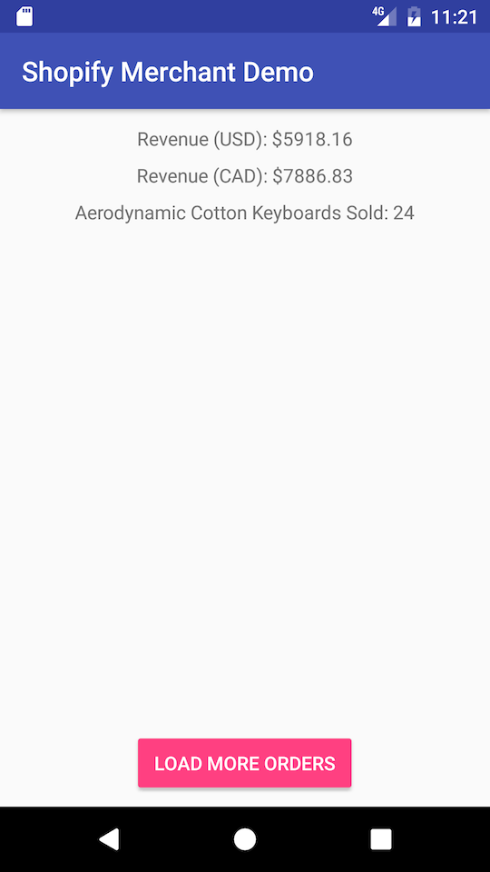
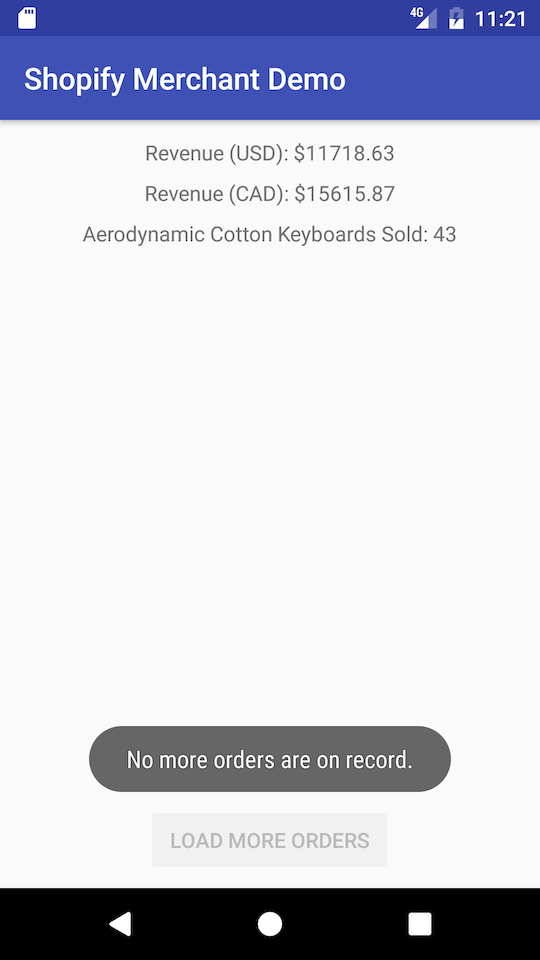

# Shopify Demo (F17 Internship Application)

This is my code for the Shopify internship application. I have tackled the Mobile Development problem for my application.

## First of all, the results

### First Orders Page Only
- Total Revenue (CAD): 5918.16
- Total Revenue (USD): 7886.83
- \# Of Keyboards Sold: 24

### All Orders Pages
- Total Revenue (CAD): 11718.63
- Total Revenue (USD): 15615.87
- \# Of Keyboards Sold: 43

## Screenshots

## Testing
This codebase includes unit tests to go with the implementation. I'm fond of the TDD approach and iteratively writing tests to keep the specification up to date. You can find these in the `app/src/test/` directory.

## Assumptions

1. For tallying the `total_revenue` of Orders, the currency `CAD` is hardcoded. For demonstration purposes and knowing that the endpoint was hardcoded, it felt it might be overkill to uniquely categorize the total revenue by currency. For a full-sized project, I imagine I would have taken a Map based approach where tallying revenue by currency would be much more managable.
2. I've only deserialized the parts of the models that deemed useful for this problem, as well as a few additional fields that are typical of a model and/or would be nice-to-have in scaling this problem into a grander feature.

## Considerations

### 1. The presenter doesn't survive rotation.
I have approached the problem with an MVP implementation, and of course that begs the age-old Android question: "does it survive rotation?" The short answer for this project is no. There's obviously many approaches and philosophies around the great rotation problem; one of the more obvious being that you cache whatever needs to survive through a mechanism that has a longer lifecycle than the activity. 

In this case however, I felt that would be a little weird to do - a presenter is typically tied to a view and the lifecycle of both should remain relatively coupled together. For example, a presenter should not live throughout the lifetime of the app, if the activity will only be shown for a few seconds. To cache it would be to open these can of worms; frankly it didn't seem productive to answer that in the context of this problem.

### 2. The `ApplicationComponent` doesn't actually get used to inject anything?
Yeah, this one's kind of true. I mainly used it as a vessel for the `PresenterComponent` to demonstrate encapsulation of scope. It's also a bit of a habit for me since this is a typical Dagger infrastructure a project would take before the use-cases become clearly defined.

### 3. The activity isn't tested.
This one was a bit of a tricky situation due to Dagger; the `PresenterComponent` gets built at the Activity level with an `@ActivityScope`, and sticking in a `TestPresenterModule` to build it so that we have a presenter mock in the unit test, would've required some ugly code. For time constraints I haven't entertained a full solution I'd want to endorse, but I'll revisit this sometime in the future.

## Thank You For Your Time!
Thanks for taking the time to look at this, and if there are any pointers you're open to sharing with me I definitely want to hear how I can make my code better. Shoot me a message or open an Issue and let's chat!